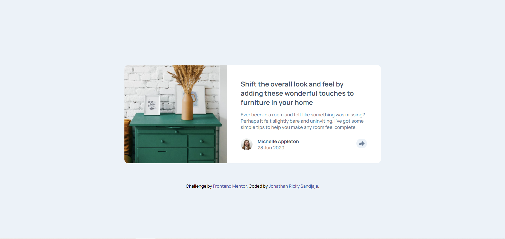

# Frontend Mentor - Article preview component solution

This is a solution to the [Article preview component challenge on Frontend Mentor](https://www.frontendmentor.io/challenges/article-preview-component-dYBN_pYFT). Frontend Mentor challenges help you improve your coding skills by building realistic projects. 

## Table of contents

- [Overview](#overview)
  - [The challenge](#the-challenge)
  - [Screenshot](#screenshot)
  - [Links](#links)
- [My process](#my-process)
  - [Built with](#built-with)
  - [What I learned](#what-i-learned)
  - [Useful resources](#useful-resources)
- [Author](#author)
- [Acknowledgments](#acknowledgments)

## Overview

### The challenge

Users should be able to:

- View the optimal layout for the component depending on their device's screen size
- See the social media share links when they click the share icon

### Screenshot



### Links

- Solution URL: [My Solution](https://github.com/joricky91/Article-Preview-Component)
- Live Site URL: [My Solution's Live Site](https://article-preview-joricky91.netlify.app/)

## My process

### Built with

- Semantic HTML5 markup
- CSS custom properties
- Flexbox
- Mobile-first workflow

### What I learned

One thing I learned is to make other shape. We have to make a triangle shape in this challenge, I'm a bit confused at first, but after I saw Agam Singh's Youtube Channel, I noticed I don't have to make a triangle shape, instead I could make a block, and rotate it 45deg.

```
.text .user .triangle{
    display: none;
    width: 20px;
    height: 20px;
    background-color: var(--very-dark-grayish-blue);
    position: absolute;
    left: 93%;
    bottom: 130%;
    transform: rotate(45deg);
}
```
At first, I create 2 Javascript function, 1 for opening the share box when clicking the share icon, and the second one to close the share box, but it only worked on the mobile version because the desktop version doesn't has the share icon on the share box. I got the solution from Joseph Madrid on Slack to just create a function and check if the share box isn't active then set the display to flex, otherwise set it to none. But I also made another function because in the mobile version the share icon on the share box must be clicked if you want to close the box.
```
const iconClick = document.querySelector(".icon");
const shareBtn = document.querySelector(".share-button");
const triangle = document.querySelector(".triangle");
const shareIcon = document.querySelector(".share-icon");
iconClick.addEventListener("click", () => {
    if (shareBtn.style.display == "none" && triangle.style.display == "none"){
        shareBtn.style.display = "flex";
        triangle.style.display = "flex";
    }
    else{
        shareBtn.style.display = "none";
        triangle.style.display = "none";
    }
});

shareIcon.addEventListener("click", () => {
    shareBtn.style.display = "none";
    triangle.style.display = "none";
});
```

### Useful resources

- [Agam Singh's Youtube Channel](https://www.youtube.com/watch?v=UxoAQUPsZbQ&t=257s) - This helped me to style the triangle when clicking share button in desktop version. 

## Author

- Frontend Mentor - [joricky91](https://www.frontendmentor.io/profile/joricky91)
- Twitter - [@joricky91](https://twitter.com/joricky91)

## Acknowledgments

Thank you very much for Agam Singh's Youtube Channel for the help in creation of the triangle, and also thank you for Joseph Madrid (member ID : U02AMALSH6V) on Slack that helps me with the Javascript.
